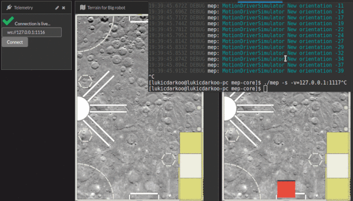

# MEP Dashboard
Dashboard (with server) is tool for collecting, analysing and visualising data from robot.



## Installation
*only for Debian distros

- Install Node.js & npm
```
curl -sL https://deb.nodesource.com/setup_7.x | sudo -E bash -
sudo apt-get install -y nodejs
```
- Install git `sudo apt-get install git`
- Install MEP Dashboard
```
git clone https://github.com/Memristor-Robotics/mep-dash.git --depth 1 && cd mep-dash && ./install
```

## Start
Run `./dash` or `node Bootstrap.js`

## Import/Export
- Use `./dash --load-settings` to load settings to to Kibana,
- or `./dash --save-settings` to store settings for later usage.
